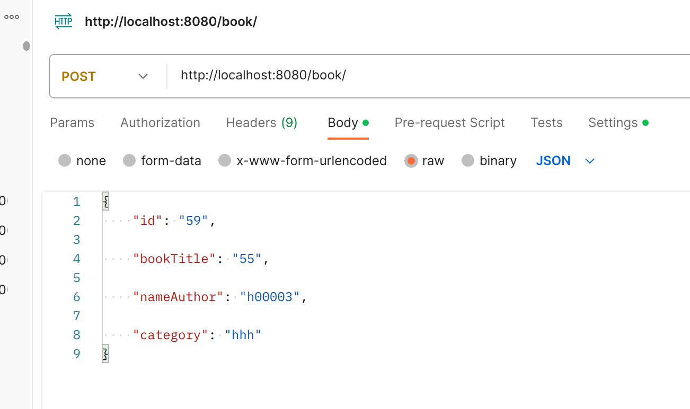
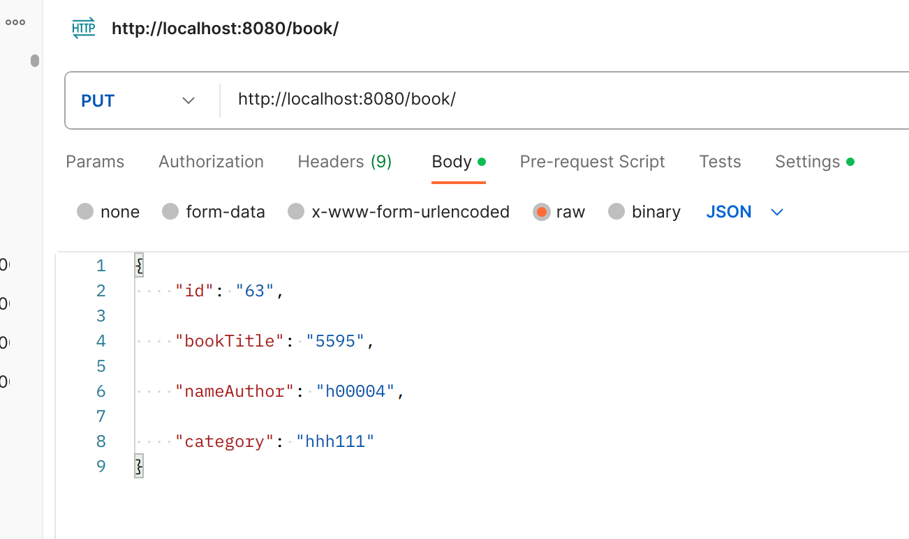
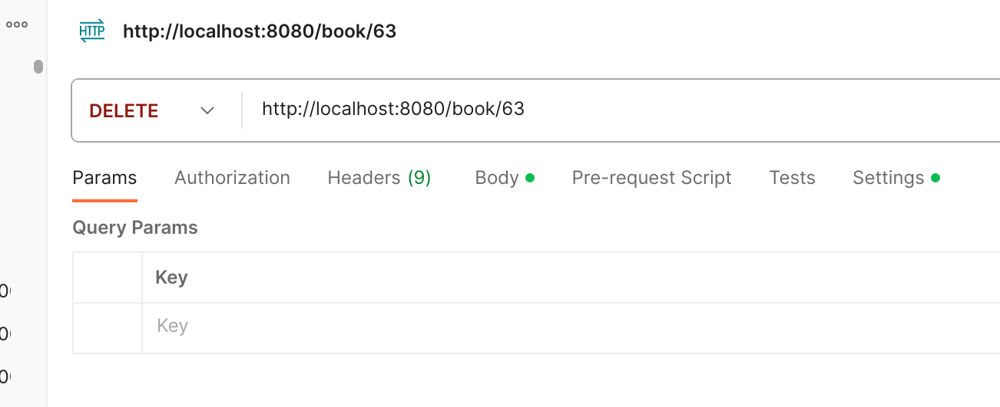

# book-management

REST API for book management

# 5_8_practical_work
Консольное приложение "book-management" разработано в рамках практической работы по курсу Разработка на Spring Framework (раздел
Интеграция с внешними системами (Rest)).

Описание работы приложения:

Команды вводятся с помощью HTTP запросов:
Создание книг и управление ими (Создание - ,

изменение - ,

и удаление книги - );

Настройки работы программы осуществляются через изменение application.properties:

spring.datasource.url=jdbc:postgresql://localhost:5434/postgres Настройка доступа к базе данных.
spring.datasource.username=postgres Логин пользователя для доступа к базе данных.
spring.datasource.password=postgres Пароль пользователя для доступа к базе данных.

spring.data.redis.host=localhost - Настройка доступа к базе Redis (используется в качестве кэш). 
spring.data.redis.port=6379 - Настройка порта Redis.

